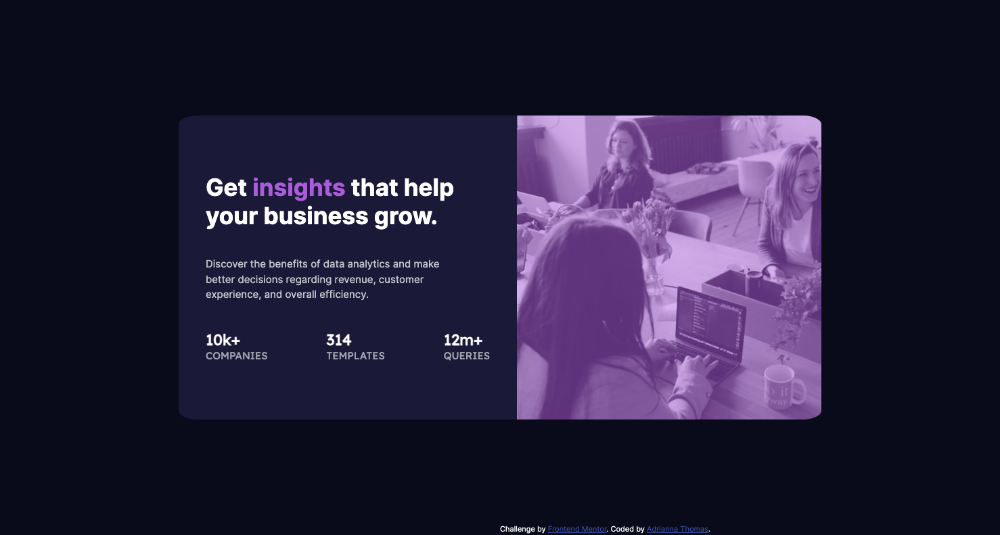

# Frontend Mentor - Stats preview card component solution

This is a solution to the [Stats preview card component challenge on Frontend Mentor](https://www.frontendmentor.io/challenges/stats-preview-card-component-8JqbgoU62). Frontend Mentor challenges help you improve your coding skills by building realistic projects.

## Table of contents

- [Overview](#overview)
  - [The challenge](#the-challenge)
  - [Screenshot](#screenshot)
  - [Links](#links)
- [My process](#my-process)
  - [Built with](#built-with)
  - [What I learned](#what-i-learned)
  - [Continued development](#continued-development)
  - [Useful resources](#useful-resources)
- [Author](#author)
- [Acknowledgments](#acknowledgments)

## Overview

### The challenge

Users should be able to:

- View the optimal layout depending on their device's screen size

### Screenshot



### Links

- Solution URL: [Add solution URL here](https://your-solution-url.com)
- Live Site URL: [Add live site URL here](https://your-live-site-url.com)

## My process

### Built with

- Semantic HTML5 markup
- CSS custom properties
- Flexbox

### What I learned

I learned how to specify a style within a sentence by using span:

```html
<h1>Get <span class="bold">insights</span> that help your business grow.</h1>
```

I learned how to do an image overlay.

```css
.card-image {
  min-width: 450px;
  width: 100%;
  height: 450px;
  background: url(/images/image-header-desktop.jpg);
  background-size: cover;
  background-repeat: no-repeat;
  overflow: hidden;
  vertical-align: middle;
}
.overlay {
  background: var(--accent);
  height: 100%;
  opacity: 0.5;
}
```

I learned how to change the viewing position for mobile design and the image using a media query.

```css
@media only screen and (max-width: 375px) {
  .card {
    display: flex;
    flex-direction: column-reverse;
  }

  .card-image {
    background: url(/images/image-header-mobile.jpg);
    height: 100%;
    background-size: cover;
    background-repeat: no-repeat;
  }
}
```

### Continued development

Media query for mobile view.

### Useful resources

- [Example resource 1](https://github.com/santu369/frontendmentor-stats-preview-card-component/blob/main/style.css) - This helped me with figuring out how to do the image overlay. I really liked this pattern and will use it going forward.
- [Example resource 2](https://www.codeply.com/p/diAM4m0JwD) - This helped me with structuring my html.

## Author

- Frontend Mentor - [@adrianna-thomas](https://www.frontendmentor.io/profile/adrianna-thomas)

## Acknowledgments

Inspiration from other solutions.

[Dimmagerias](https://www.codeply.com/p/diAM4m0JwD)

[Chaoo Charles](https://www.youtube.com/watch?v=idvnWaZwfJQ&ab_channel=ChaooCharles)

[Celestial Viruoso](https://github.com/CelestialVirtuoso/Stats-preview-card-component-)
